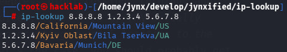
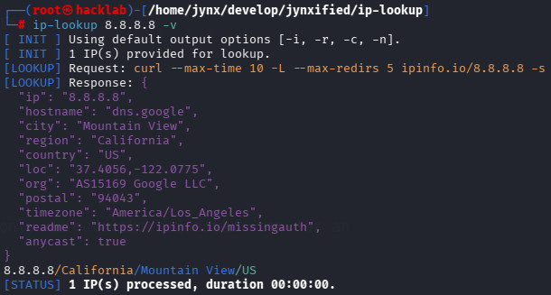
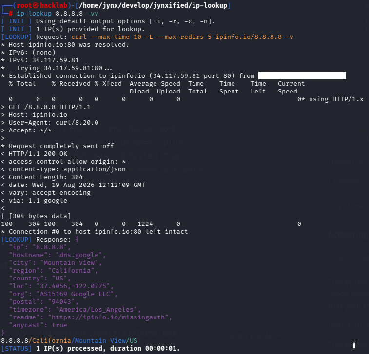

```
 _             _             _
(_)           | |           | |               
 _ _ __ ______| | ___   ___ | | ___   _ _ __  
| | '_ \______| |/ _ \ / _ \| |/ / | | | '_ \ 
| | |_) |     | | (_) | (_) |   <| |_| | |_) |
|_| .__/      |_|\___/ \___/|_|\_\\__,_| .__/ 
  | |                                  | |    
  |_|                                  |_|    
       ::: Version 1.0.0 | @Jynx :::
 
```

# ## ip-lookup
Have you ever spent a sleepless night tossing, turning, and questioning your life choices, like: *"Is my VPN actually protecting me, or am I broadcasting my real location to the entire internet?"* If that's the case, you should probably get some professional help, ASAP. Or, you know, save yourself a shitload of money on a shrink and use this nifty little tool to reach true inner peace.

**ip-lookup** is a Bash-based utility that fetches geolocation data for any IP, even your own, including the precise city, region, country, and other cool stuff.

Here's how an exemplary output of our own IP looks like:


And here's another example with multiple dedicated IPs:



## ## Features

- **Blabbermouth:** Supports a total of 5 geolocation data points: city, region, nation, zipcode, and geolocation coordinates. (Seriously, no one needs more...)
- **With a snap of your fingers:** Each geo-data point can be individually enabled (or skipped) via command-line options based on your preferences.
- **Not so fast...:** Includes built-in request throttling to artificially delay lookups, helping you stay safely within daily or per-minute caps. I'll explain why that might be necessary in the next chapter.

## ## Prerequisites

**ip-lookup** uses the public [ipinfo.io](https://ipinfo.io/) API to fetch all of its data.

In case that doesn't ring a bell: That's a popular, highly reliable API service designed to provide accurate IP address data in real time. Or, in plain English: think of it as the ultimate internet detective for IP addresses. It takes any IP you throw at it and uncovers everything about it. Neat, huh?

Technically, this script acts as a wrapper around ipinfo.io, making its API easy to interact with directly from your command line.

Now here’s the key part: ipinfo.io offers both unauthenticated access to its API—which (logically) doesn't require signing up or creating an account—and authenticated access using an API token. The first one lets you use the API instantly with zero setup, but it comes with strict daily rate limits. The latter one requires a free API token, unlocking significantly higher request limits. 

You can check out the exact limits here: [https://ipinfo.io/developers#rate-limits](https://ipinfo.io/developers#rate-limits).

**ip-lookup** supports both access types.

If you're happy with anonymous access and its rate limits (which should cover most daily use cases), you can safely skip the rest of this section. Unless you just love reading unnecessary stuff. If so, knock yourself out! However, if you require the extended limits or simply want to show off to your buddies, you’ll have to sign up for an ipinfo.io account. You can do that here: [https://ipinfo.io/pricing](https://ipinfo.io/pricing).

Once you've done that, you'll receive a unique API token. You can find it here after logging in to your new account: [https://ipinfo.io/account/token](https://ipinfo.io/account/token).

Copy this token and save it to a file of your choice in a directory of your choice. Ideally somewhere you can actually find again without hiring a tracker. And please, just the token—nothing else. No recipes, no grocery lists, no love letters. Just the token!

## ## Installation

Clone the repository and navigate into the project directory:

```bash
git clone https://github.com/jynxified/ip-lookup.git
cd ip-lookup
```

Make the script executable:

```bash
chmod +x ip-lookup.sh
```

*"Wait, that’s it? Nothing else?"* Yep, that’s literally it. **ip-lookup** is now installed. Incredibly simple, isn't it?

## ## Usage

```
ip-lookup OPTIONS [IP ...]
```

### IPs

You can pass any number of IPs to **ip-lookup** to be resolved. However, you don't HAVE to. If you don't provide an IP at all, it will automatically resolve your own current WAN IP.

### Options

#### Specifying ipinfo.io API token file

```
-a, --apikey FILE
```

Use this option to specify the path and name of the file containing your ipinfo.io API token, in case you have one and want to benefit from higher request limits. You don't remember what that means? Well, then please go back and check the "Prerequisites" section—everything you need to know about this issue is right there.

This option is **optional**, which—besides the fact that it’s an extremely hilarious sentence—means that you can specify it, but you don't have to. Mind-blowing, I know.

Example:

```
ip-lookup -a ./myAPIkey.txt 8.8.8.8
```

#### Throttling IP lookup requests

```
-t, --throttle SECONDS
```

Use this option to specify a delay in seconds between consecutive lookup requests. Depending on whether you use ipinfo.io with or without an account, your request limits will be higher or lower (I'll never tire of saying this, obviously).

This option is **optional**, i.e. you can use it but you don't have to. If you omit it, the default value of 0 will be used, which, usurprisingly, means no delay whatsoever, lookup requests will run immediately one after another.

Example:

```
ip-lookup -t 3 8.8.8.8
```

#### IP Output Option

```
-i, --ip
```

Enabling this option outputs the target IP to your terminal, which is either your current WAN IP or whichever IP you handed to the script.

Example:

```
ip-lookup -i 8.8.8.8
```

This option is **optional**. (Seriously, what a sentence...)

#### Region Output Option

```
-r, --region
```

Enabling this option outputs the geographic region of the target IP to the console.

Example:

```
ip-lookup -r 8.8.8.8
```

This option is **optional**. (What's that, smartass? Got a better description? Then hit me!)

#### City Output Option

```
-c, --city
```

Enabling this option outputs the geographic city of the target IP to the console.

Example:

```
ip-lookup -c 8.8.8.8
```

This option is **optional...** now stop giving me that look!!!

#### Nation Output Option

```
-n, --nation
```

Enabling this option outputs the geographic nation (i.e., the country) of the target IP to the console.

Example:

```
ip-lookup -n 8.8.8.8
```

Alright, alright, you brought this on yourself—I'm NOT writing "This option is **optional**" anymore (although it is). There you go, are you happy now?

#### ZIP Code Output Option

```
-z, --zipcode
```

Enabling this option outputs the geographic ZIP code of the target IP to the console.

Example:

```
ip-lookup -z 8.8.8.8
```

No, I'm NOT saying it...

#### Geolocation Output Option

```
-g, --geolocation
```

Enabling this option outputs the geolocation coordinates of the target IP to the console, which you could, for instance, paste into Google Maps to officially become a stalker creep.

Example:

```
ip-lookup -g 8.8.8.8
```

Forget it, I'm NOT saying it!!!

#### Full Output Option

```
-f, --full
```

This is a convenience option equivalent to passing -i, -c, -r, -n, -z, and -g together. As a result, the script prints all available geolocation data plus the IP to the terminal. It’s basically the "Lazy Person's Option", but "Full Output Option" sounds way catchier.

Example:

```
ip-lookup -f 8.8.8.8
```

Do you really think a half-baked apology makes everything right again? Huh? Do you? I have feelings too, damn it! I'm NOT saying the "optional"-sentence anymore.

#### Include Own IP Option

```
-o, --own
```

As noted before, **ip-lookup** looks up your own WAN IP when no custom IPs are supplied. If you're passing a list of IPs but also want your own address in the mix, this option has you covered. It ensures that both your specified IPs and your own public WAN IP get queried.

Example:

```
ip-lookup -o 8.8.8.8
```

Oh, great, a bouquet of flowers—now THAT is truly creative. NOT!!!

#### Activating Debug mode

```
-v, --verbose
```

Normally, **ip-lookup** only outputs the requested data for an IP.

However, if you want the script to output more information than just this single information—such as the specific requests being sent or their results—this option lets you enable debug mode, which is significantly more "talkative".

Here's an example of the output:



Okay, okay, let's stop arguing. Fine, I'll say it again: This option is **optional**... HEY, why are you laughing???

Example:

```
ip-lookup 8.8.8.8 -v
```

#### Activating Trace mode

```
-vv, --ultraverbose
```

This option is essentially the big brother of the Debug mode. When enabled, it outputs everything the Debug mode does, plus quite a bit more. Trust me, it doesn't get more detailed than this! **ip-lookup** will tell you so much that your eyes and ears will bleed, and you'll be begging for mercy.

Here's an example of the output:



Bite me! I'm not saying it anymore. I'm off to Moe's.

Example:

```
ip-lookup 8.8.8.8 -vv
```

## ## Default Output

Even though you'd probably figure this out quickly just by running the program, I happen to be a thorough (some say pedantic) and detail-oriented person (some say nutbag). Anyway: if you don't specify a single output option, the script defaults to printing the IP itself, the city, the region, and the nation for every IP.

If you want things done differently, you'll need to use the options outlined above.

## ## Disclaimer

**ip-lookup** is provided "as is" without any warranty of any kind, either expressed or implied. Use it entirely at your own risk. The author (that's me) shall not be liable for any damages, data loss, system failures, or serious trouble you, your relatives, their neighbours or beloved pets might get into caused by the use or misuse of it.

And no, I have no affiliation—business, personal, gambling-debt-related, or involving embarrassing photos—with ipinfo.io. Even though they know everything about me. I mean, EVERYTHING! Who I am. Where I live. And they can read my thoughts, I can feel it! But not for much longer, you bastards, I wasn't born yesterday, I know what's up, you've manipulated me long enough!!! I'm gonna take you all... HEY, what do you want from me? Why should I come with you? Why should I put on this weird jacket??? And don't you dare tell me when to stop typing, I'll type as long as I w...

## ## License

(Following a heavy shot of a potent sedative...)

This project is licensed under **[CC BY-NC-ND 4.0](https://creativecommons.org/licenses/by-nc-nd/4.0/)** (Attribution-NonCommercial-NoDerivatives). 

In terms normal humans can understand, this means:

* **Non-Commercial Use:** You are free to use, share, and enjoy it for personal or educational purposes.
* **Commercial Use:** Strict no-go without my explicit written permission.
* **No Modifications:** You cannot change, tweak, or remix this script (or parts of it) and redistribute it without my explicit written permission.

When in doubt, just hit me up. Most people say I'm a nice guy. (The others were never heard from again.)

## ## Contact

What a brilliant transition: here is my contact info in case you want to get in, well, contact with me.

[jynxified@proton.me](jynxified@proton.me)

## ## History

* **1.0.0 (2026-08-19):** Initial version.